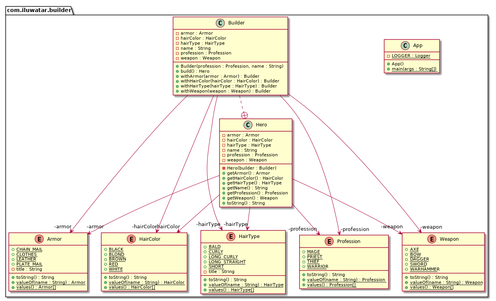

## 目的

将复杂对象的构造与其表示分开，以便同一构造过程可以创建不同的表示。

## 解释

现实世界例子

> 想象一个角色扮演游戏的角色生成器。最简单的选择是让计算机为你创建角色。但是如果你想选择一些像专业，性别，发色等角色细节时，这个角色生成就变成了一个渐进的过程。当所有选择完成时，该过程也将完成。

用通俗的话说

> 允许你创建不同口味的对象同时避免构造器污染。当一个对象可能有几种口味，或者一个对象的创建涉及到很多步骤时会很有用。

维基百科说

> 建造者模式是一种对象创建的软件设计模式，旨在为伸缩构造器反模式寻找一个解决方案。

说了这么多，让我补充一下什么是伸缩构造函数反模式。我们肯定都见过像下面这样的构造器：

```java
public Hero(Profession profession, String name, HairType hairType, HairColor hairColor, Armor armor, Weapon weapon) {
}
```

就像你看到的构造器参数的数量很快就会失控同时参数的排列方式可能变得难以理解。另外，如果您将来希望添加更多选项，则此参数列表可能会继续增长。这就被称伸缩构造器反模式。

**编程示例**

明智的选择是使用建造者模式。首先我们有一个英雄要创建。

```java
public final class Hero {
  private final Profession profession;
  private final String name;
  private final HairType hairType;
  private final HairColor hairColor;
  private final Armor armor;
  private final Weapon weapon;

  private Hero(Builder builder) {
    this.profession = builder.profession;
    this.name = builder.name;
    this.hairColor = builder.hairColor;
    this.hairType = builder.hairType;
    this.weapon = builder.weapon;
    this.armor = builder.armor;
  }
}
```

然后我们有创建者

```java
  public static class Builder {
    private final Profession profession;
    private final String name;
    private HairType hairType;
    private HairColor hairColor;
    private Armor armor;
    private Weapon weapon;

    public Builder(Profession profession, String name) {
      if (profession == null || name == null) {
        throw new IllegalArgumentException("profession and name can not be null");
      }
      this.profession = profession;
      this.name = name;
    }

    public Builder withHairType(HairType hairType) {
      this.hairType = hairType;
      return this;
    }

    public Builder withHairColor(HairColor hairColor) {
      this.hairColor = hairColor;
      return this;
    }

    public Builder withArmor(Armor armor) {
      this.armor = armor;
      return this;
    }

    public Builder withWeapon(Weapon weapon) {
      this.weapon = weapon;
      return this;
    }

    public Hero build() {
      return new Hero(this);
    }
  }
```

然后可以这样使用

```java
var mage = new Hero.Builder(Profession.MAGE, "Riobard").withHairColor(HairColor.BLACK).withWeapon(Weapon.DAGGER).build();
```

## 类图



## 适用性

使用建造者模式当

* 创建复杂对象的算法应独立于组成对象的零件及其组装方式
* 构造过程必须允许所构造的对象具有不同的表示形式

## Java世界例子

* [java.lang.StringBuilder](http://docs.oracle.com/javase/8/docs/api/java/lang/StringBuilder.html)
* [java.nio.ByteBuffer](http://docs.oracle.com/javase/8/docs/api/java/nio/ByteBuffer.html#put-byte-) as well as similar buffers such as FloatBuffer, IntBuffer and so on.
* [java.lang.StringBuffer](http://docs.oracle.com/javase/8/docs/api/java/lang/StringBuffer.html#append-boolean-)
* All implementations of [java.lang.Appendable](http://docs.oracle.com/javase/8/docs/api/java/lang/Appendable.html)
* [Apache Camel builders](https://github.com/apache/camel/tree/0e195428ee04531be27a0b659005e3aa8d159d23/camel-core/src/main/java/org/apache/camel/builder)
* [Apache Commons Option.Builder](https://commons.apache.org/proper/commons-cli/apidocs/org/apache/commons/cli/Option.Builder.html)

## 鸣谢

* [Design Patterns: Elements of Reusable Object-Oriented Software](https://www.amazon.com/gp/product/0201633612/ref=as_li_tl?ie=UTF8&camp=1789&creative=9325&creativeASIN=0201633612&linkCode=as2&tag=javadesignpat-20&linkId=675d49790ce11db99d90bde47f1aeb59)
* [Effective Java](https://www.amazon.com/gp/product/0134685997/ref=as_li_tl?ie=UTF8&camp=1789&creative=9325&creativeASIN=0134685997&linkCode=as2&tag=javadesignpat-20&linkId=4e349f4b3ff8c50123f8147c828e53eb)
* [Head First Design Patterns: A Brain-Friendly Guide](https://www.amazon.com/gp/product/0596007124/ref=as_li_tl?ie=UTF8&camp=1789&creative=9325&creativeASIN=0596007124&linkCode=as2&tag=javadesignpat-20&linkId=6b8b6eea86021af6c8e3cd3fc382cb5b)
* [Refactoring to Patterns](https://www.amazon.com/gp/product/0321213351/ref=as_li_tl?ie=UTF8&camp=1789&creative=9325&creativeASIN=0321213351&linkCode=as2&tag=javadesignpat-20&linkId=2a76fcb387234bc71b1c61150b3cc3a7)